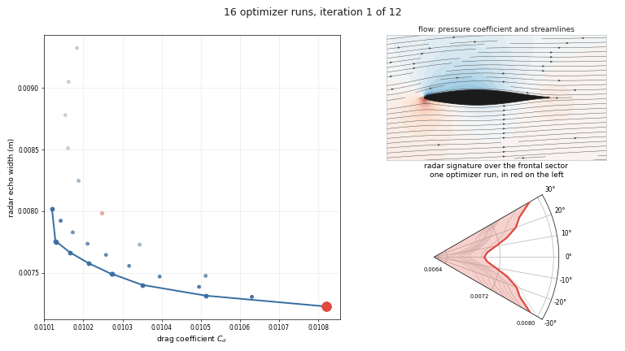
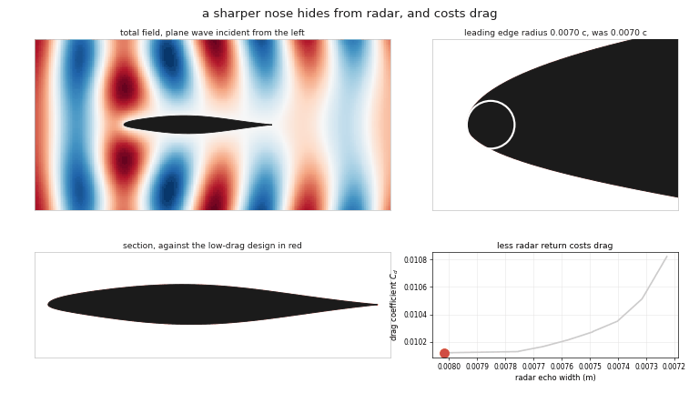

# aerostealth

Gradient-based RCS vs drag co-design. Three differentiable components composed
behind Tesseract's uniform `jvp`/`vjp` interface so that
`theta -> (Cd, Cl, sigma_agg, g_geom)` is one `jax.value_and_grad`-able program,
traced across a stealth-vs-aero Pareto front by an epsilon-constraint sweep.

- `geom` (JAX, reverse-mode autodiff): CST airfoil to boundary curve, differentiable
  rasterization, geometric constraints.
- `cfd` (OpenFOAM `adjointOptimisationFoam`): mesh morph, primal RANS at fixed
  angle of attack, drag and lift adjoint sensitivities.
- `em` (JAX method of moments): 2D EFIE on the PEC contour, monostatic echo width,
  KS-aggregated and differentiated by autodiff.
- `driver`: composes `geom -> {cfd, em}` with `tesseract-jax` and runs the sweep.

The method, the Pareto front and the gradient validation are written up in
[paper/writeup.md](paper/writeup.md).

License: Apache-2.0.

## The front

16 MMA runs converging on the front, one design at a time, colouring blue as
they approach it. One run is picked out in red, and the panels on the right show
its flow and radar signature as it descends. The front is then walked end to
end, with the panels following the design under the cursor:



Echo width falls 16.5 percent at no drag cost, then a further 9.9 percent costs
6.9 percent of drag. The reason is the leading edge: it sharpens from 0.0070 to
0.0032 chords along the front, which removes the specular return and deepens the
suction peak.



## Environment

Python 3.11 or newer, in a fresh virtual environment:

```
pip install -e ".[analysis,dev]"
```

The `cfd` leg additionally needs OpenFOAM with `adjointOptimisationFoam` (ESI
v2606 or compatible). Point the runner at its `bashrc`:

```
export AEROSTEALTH_OF_BASHRC=/path/to/OpenFOAM/etc/bashrc
```

The reference grid is OpenFOAM's own adjoint-tutorial NACA 0012 mesh, already
vendored into the repo. Everything except the `cfd` leg runs without OpenFOAM.

Run on CPU (`export JAX_PLATFORMS=cpu`); the problems are small and the GPU path
is far slower here.

## Layout

```
tesseracts/   geom/ cfd/ em/     one tesseract_api.py + tesseract_config.yaml each
driver/       forward.py optimize.py objectives.py tesseracts.py
              mgda.py surrogate.py  (stubs, not on the path)
configs/      baseline.yaml sweep.yaml
analysis/     pareto.py plots.py gradient_check.py report.py
tests/        per-tesseract FD checks + end-to-end gradient check
paper/        writeup.md
```

## Run

```
pytest
python -m driver.optimize --baseline configs/baseline.yaml --sweep configs/sweep.yaml
python -m analysis.report
python -m analysis.animate             # the two animations above
```

The sweep writes the front to `outputs/pareto.json`, and one
`outputs/trajectory_<level>.jsonl` per epsilon level holding a record per design
evaluated (shape, coefficients, RCS polar, gradient, OpenFOAM case directory).
`analysis.report` turns those into figures.

Slow tests shell out to OpenFOAM; opt in with `AEROSTEALTH_SLOW_TESTS=1`.
