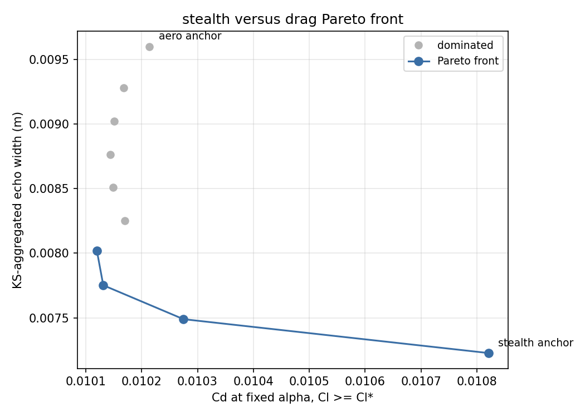
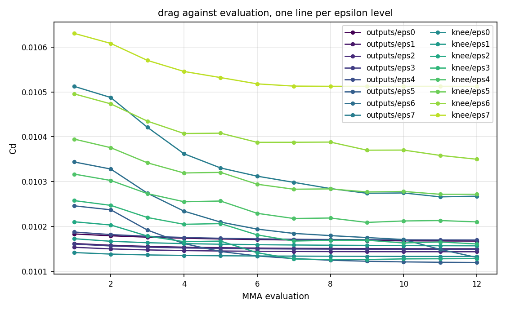
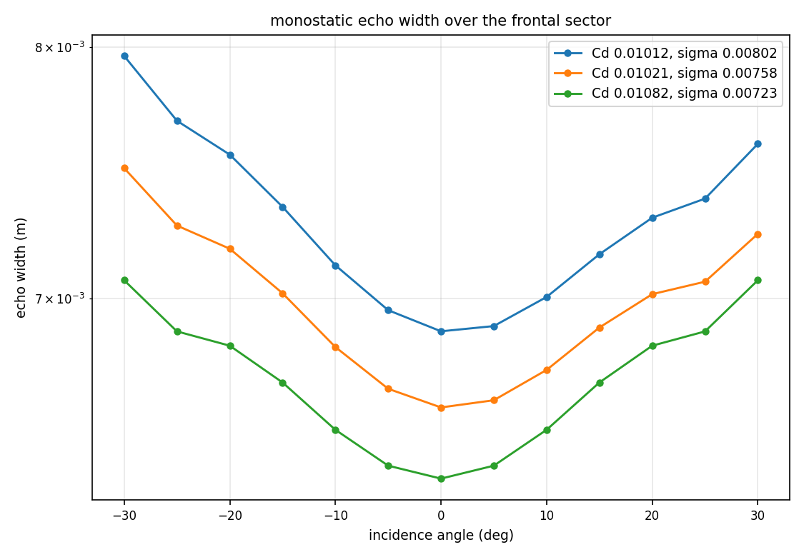
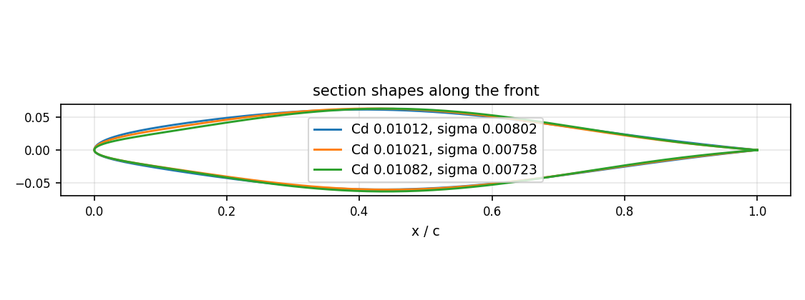
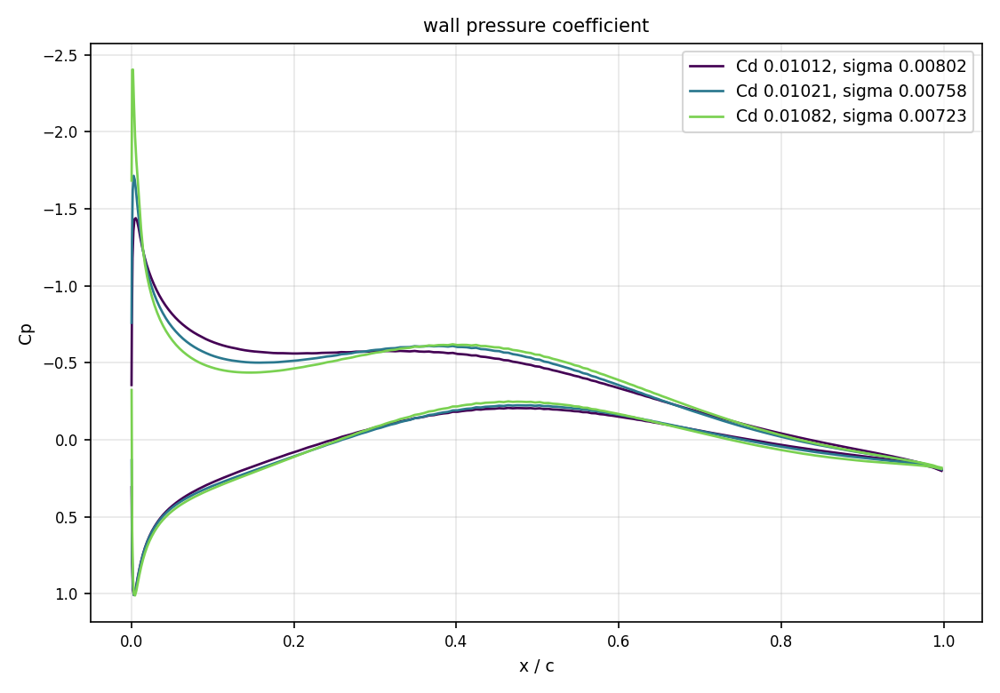
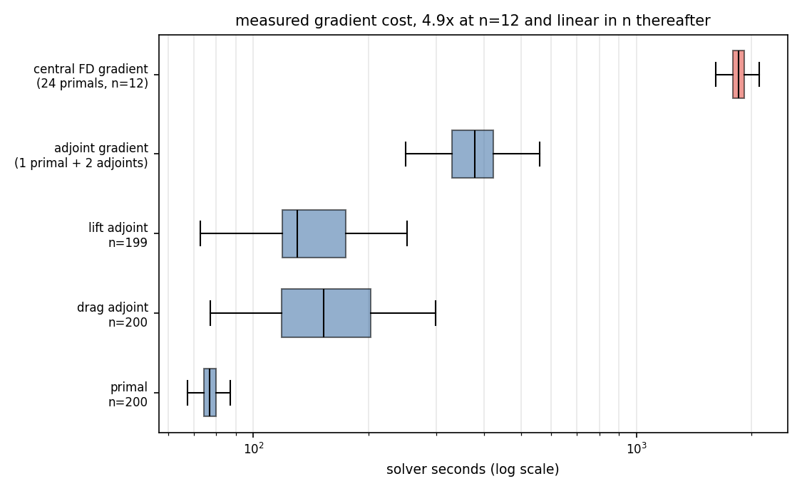
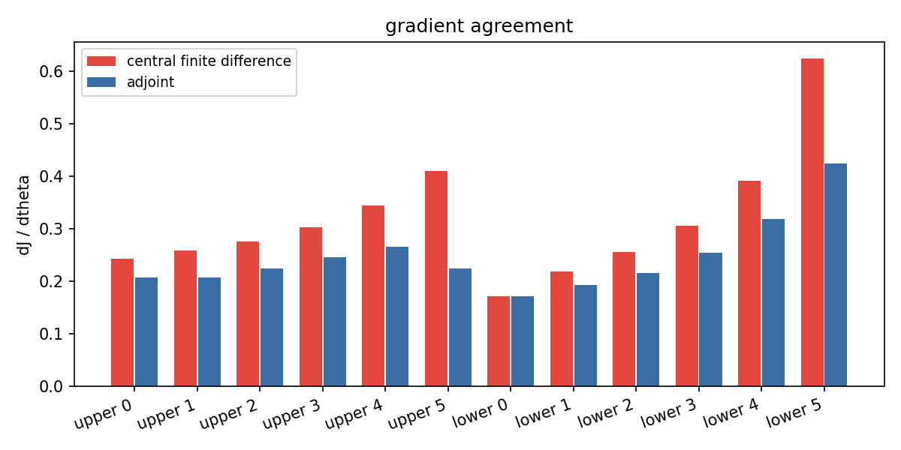
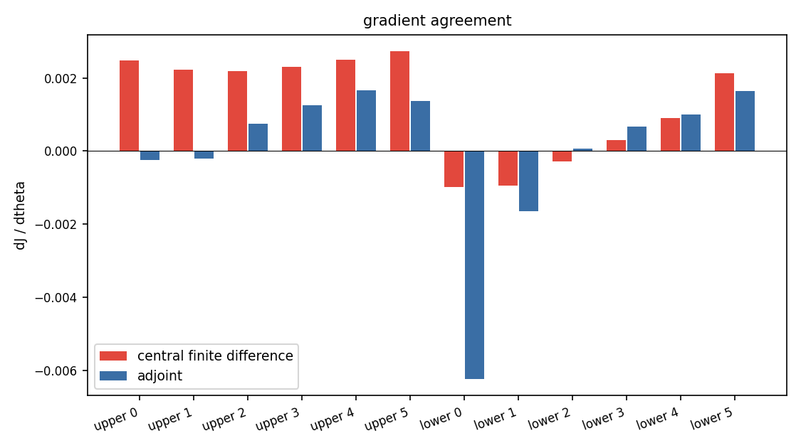

# Gradient-based co-design of airfoil drag and radar cross section

Simranjeet Singh

## Abstract

An airfoil that is aerodynamically efficient and one that scatters little radar
energy are not the same shape. We compute the trade-off between the two
directly, by gradient-based optimization over a shared geometry
parameterization. Drag and lift come from an incompressible RANS solve with a
continuous adjoint. The monostatic echo width over a frontal sector comes from a
2D method-of-moments solver differentiated by reverse-mode autodiff. The two
solvers use different languages, different discretizations and different
differentiation strategies, so the main technical problem is to make the
gradient cross between them. We compose them behind a uniform `jvp`/`vjp`
interface, which turns the map from the design vector to every objective and
constraint into one differentiable program, and trace the Pareto front with an
epsilon-constraint sweep driven by MMA. On the resulting front, echo width falls
16.5 percent at no drag cost, after which a further 9.9 percent of echo width
costs 6.9 percent of drag.

> **Hackathon submission**
>
> **Track:** 01, Inverse design and shape optimization. The gradient crosses a
> tool boundary, from a CST spline through an RBF mesh morph into a
> finite-volume solver, with reverse-mode autodiff on one side and an OpenFOAM
> continuous adjoint on the other.
>
> **Cross-track:** 02, Multi-physics and coupled systems. Two solvers from
> different domains share one optimizable pipeline, though they are coupled
> through the geometry rather than by exchanging fields.

## 1. Problem

Minimize drag at fixed lift, and minimize the peak radar return over a frontal
incidence sector. The two objectives pull the same geometry in different
directions. Low drag favours a smooth section with a rounded leading edge. Low
echo width favours flatness that directs the specular return out of the sector.

The design object is a 2D airfoil section of chord 1, parameterized by 12 CST
(Kulfan) Bernstein weights, 6 per surface. The baseline is a NACA 0012 (Abbott
and von Doenhoff, 1959) at $Re = 6 \times 10^6$, held at $C_l \geq 0.4$. The
electromagnetic problem is at 10 GHz, perfect electric conductor, TM-z
polarization, with the chord scaled to 0.05 m so that $k c \approx 10.5$,
monostatic, at 13 angles over $[-30, 30]$ degrees.

The front is traced by the epsilon-constraint form

```math
\min_\theta \; C_d(\theta) \quad \text{s.t.} \quad
\sigma_\mathrm{agg}(\theta) \leq \varepsilon_k, \;\;
C_l(\theta) \geq C_l^{\ast}, \;\;
g_\mathrm{geom}(\theta) \leq 0
```

at a fixed angle of attack, sweeping $\varepsilon_k$ between two anchor designs.

## 2. Method

The pipeline has three components. They differ on every axis that normally
prevents a gradient from crossing between them:

| axis           | `geom`                | `cfd`                        | `em`                     |
|----------------|-----------------------|------------------------------|--------------------------|
| language       | JAX / XLA             | C++ (OpenFOAM)               | JAX / XLA                |
| AD strategy    | reverse-mode autodiff | continuous adjoint of a PDE  | reverse-mode autodiff    |
| discretization | analytic CST spline   | unstructured finite volume   | boundary-element contour |
| gradient cost  | microseconds          | minutes, two PDE solves      | milliseconds             |

Each component is packaged as a Tesseract (Haefner and Lavin, 2025), which gives
it a uniform set of endpoints: `apply`, `jacobian`, `jacobian_vector_product`,
`vector_jacobian_product` and `abstract_eval`. `geom` and `em` are pure JAX and
obtain all five from `tesseract_core.runtime.jax_recipes`. `cfd` declares the
same interface but implements `apply` and `vector_jacobian_product` by running
OpenFOAM and parsing its output. `abstract_eval` is required rather than
optional, because the composition layer needs output shapes without running the
solver, and for a leg that costs minutes that distinction matters.

`tesseract-jax` (Pasteur Labs, n.d.) then composes the three into a single
function that `jax.grad` can differentiate. The driver writes the forward map
once. The chain rule across the two seams is applied by JAX, not by hand.

### 2.1 geom

$\theta \mapsto$ (boundary curve `x_surf`, signed-distance level set,
constraint vector $g_\mathrm{geom}$). Each surface is a CST (class-shape
transformation) curve (Kulfan, 2008),

```math
y(\psi) = C(\psi)\,S(\psi) + \psi\,\tfrac{1}{2}\Delta z_\mathrm{te},
\qquad C(\psi) = \psi^{N_1}(1-\psi)^{N_2},
\qquad S(\psi) = \sum_{k=0}^{n-1} w_k B_{k,n-1}(\psi),
```

with $\psi = x/c$, Bernstein basis $B_{k,n}(\psi) = \binom{n}{k}\psi^k(1-\psi)^{n-k}$,
and class exponents $N_1 = 0.5$ (round leading edge), $N_2 = 1.0$ (sharp
trailing edge). The design vector $\theta$ holds the $2n = 12$ weights $w_k$ for
the two surfaces. The closed loop is emitted in Selig order at cosine-clustered
stations. The constraints bound maximum thickness above and below, the
trailing-edge gap, and the enclosed area.

`geom` is the shared spine of the pipeline. The same `x_surf` feeds both
physics legs, so a cotangent from either objective returns through the same CST
jacobian.

### 2.2 cfd

The flow is steady, incompressible and turbulent. With $\nu_t$ the eddy
viscosity, the RANS equations solved are

```math
\nabla \cdot \mathbf{u} = 0, \qquad
(\mathbf{u} \cdot \nabla)\mathbf{u} = -\nabla p
+ \nabla \cdot \left[ (\nu + \nu_t)(\nabla \mathbf{u} + \nabla \mathbf{u}^T) \right],
```

closed by the one-equation Spalart-Allmaras model (Spalart and Allmaras, 1994),
$\nu_t = \tilde{\nu} f_{v1}$, with

```math
(\mathbf{u} \cdot \nabla)\tilde{\nu} = c_{b1}\tilde{S}\tilde{\nu}
- c_{w1} f_w \left(\frac{\tilde{\nu}}{d}\right)^2
+ \frac{1}{\sigma}\left[ \nabla \cdot \big((\nu + \tilde{\nu})\nabla\tilde{\nu}\big)
+ c_{b2}|\nabla\tilde{\nu}|^2 \right],
```

where $d$ is the distance to the wall. The first cell sits at $y^+ \approx 30$,
so the wall is treated with Spalding's continuous law of the wall (Spalding,
1961),

```math
y^+ = u^+ + \frac{1}{E}\left[ e^{\kappa u^+} - 1 - \kappa u^+
- \frac{(\kappa u^+)^2}{2} - \frac{(\kappa u^+)^3}{6} \right].
```

The equations are discretized by finite volumes and solved by SIMPLE (Patankar
and Spalding, 1972) in OpenFOAM (Weller et al., 1998). The force coefficient
along a unit direction $\mathbf{e}$ is

```math
C_{\mathbf{e}} = \frac{1}{\tfrac{1}{2}U_\infty^2 A_\mathrm{ref}}
\int_S \left( p\,\mathbf{n} - \boldsymbol{\tau}\cdot\mathbf{n} \right)
\cdot \mathbf{e} \; dS,
```

with $\mathbf{e}$ aligned with the freestream for $C_d$ and normal to it for
$C_l$.

`x_surf` deforms a fixed reference C-grid by compact-support radial basis
function interpolation from the airfoil nodes (de Boer et al., 2007). The
displacement of any mesh point $\mathbf{q}$ is

```math
\Delta\mathbf{x}(\mathbf{q}) = \sum_i \varphi\!\left(
\frac{\lVert \mathbf{q} - \mathbf{c}_i \rVert}{r} \right)\boldsymbol{\alpha}_i,
\qquad \varphi(s) = (1-s)^4(4s+1) \ \text{ for } s \leq 1,
```

the Wendland $C^2$ kernel (Wendland, 1995), with the coefficients
$\boldsymbol{\alpha}$ fixed by interpolation at the surface nodes
$\mathbf{c}_i$. The far field is held fixed and the mesh is never rebuilt. The
reference grid is the NACA 0012 mesh from OpenFOAM's own adjoint tutorial, on
which the differentiated Spalart-Allmaras adjoint is known to converge.

Shape sensitivities come from the continuous adjoint (Jameson, 1988;
Papoutsis-Kiachagias and Giannakoglou, 2016) as implemented in
`adjointOptimisationFoam`, with the turbulence model differentiated rather than
frozen. The adjoint fields $(\mathbf{u}_a, p_a, \tilde{\nu}_a)$ satisfy the
equations obtained by requiring stationarity of the augmented functional

```math
L = J + \int_\Omega (\mathbf{u}_a, p_a, \tilde{\nu}_a) \cdot \mathbf{R} \; d\Omega
```

with respect to the primal state, where $\mathbf{R}$ collects the primal
residuals. The shape derivative then reduces to a surface integral giving
$dJ/dx$ at each boundary node. One adjoint solve is run per objective off the
converged primal, and the transpose of the RBF morph pulls $dJ/dx$ back to
$dJ/dx_\mathrm{surf}$.

Two details matter for correctness. First, only the normal component of the
surface sensitivity changes the shape, because tangential motion slides mesh
nodes along the same curve. The raw sensitivity field here is 45 to 60 percent
tangential, and the morph transpose cannot separate the two. Using the
normal-projected field is what makes the geometry chain exact. Second, the morph
is linear in the target curve about the reference node positions, so its
transpose must be built on those and not on the already-deformed case mesh.

### 2.3 em

For TM-z polarization the induced current on a perfectly conducting contour $C$
is scalar, and the electric field integral equation reduces to (Harrington,
1968)

```math
E_z^\mathrm{inc}(\boldsymbol{\rho}) = \frac{k\eta}{4}
\int_C J_z(\boldsymbol{\rho}')\,
H_0^{(2)}\!\left( k \lVert \boldsymbol{\rho} - \boldsymbol{\rho}' \rVert \right)
\, dl', \qquad \boldsymbol{\rho} \in C,
```

with $H_0^{(2)}$ the zeroth-order Hankel function of the second kind. Pulse basis
functions and point matching on $N$ segments give a dense system
$\mathbf{Z}\mathbf{I} = \mathbf{V}$ with

```math
Z_{mn} = \frac{k}{4}\,\Delta l_n
H_0^{(2)}\!\left( k \lVert \boldsymbol{\rho}_m - \boldsymbol{\rho}_n \rVert \right)
\quad (m \neq n), \qquad
Z_{nn} = \frac{k\,\Delta l_n}{4}\left[ 1 - j\frac{2}{\pi}
\ln\!\left( \frac{\gamma k \Delta l_n}{4e} \right) \right],
```

the diagonal using the small-argument form of $H_0^{(2)}$ with
$\gamma = 1.781\ldots$ the exponential of Euler's constant. The monostatic echo
width for incidence direction $\hat{\mathbf{k}}$ follows from the backscattered
far field,

```math
\sigma_\mathrm{2D}(\hat{\mathbf{k}}) = \frac{k}{4}
\left| \sum_n I_n \, \Delta l_n \,
e^{-jk\,\boldsymbol{\rho}_n \cdot \hat{\mathbf{k}}} \right|^2 .
```

The solve is repeated for each of the 13 incidence angles. The sector peak is
aggregated by a Kreisselmeier-Steinhauser smooth maximum (Kreisselmeier and
Steinhauser, 1979) taken in the log domain,

```math
\sigma_\mathrm{agg} = \exp\left[ \frac{1}{\rho_\mathrm{KS}}
\ln \sum_i e^{\rho_\mathrm{KS} \ln \sigma_i} \right],
```

which is an upper bound on $\max_i \sigma_i$ and is scale invariant, so
$\rho_\mathrm{KS}$ has the same meaning at any RCS level.

The implementation agrees with the analytic PEC circular cylinder series to
better than 0.07 percent for $ka$ from 1 to 10 at 200 segments, and to 0.017
percent at 800 segments. Because the solver is written in JAX (Bradbury et al.,
2018), the shape sensitivity is reverse-mode autodiff through the linear solve,
and no separate adjoint is needed.

### 2.4 Optimization

The optimizer is the method of moving asymptotes (Svanberg, 1987) through NLopt
(Johnson, 2007). MMA replaces the problem at the current iterate $\theta^{(k)}$
by a convex separable subproblem, in which each function is approximated as

```math
\tilde{f}_i(\theta) = r_i + \sum_j \left[
\frac{p_{ij}}{U_j^{(k)} - \theta_j} + \frac{q_{ij}}{\theta_j - L_j^{(k)}}
\right],
```

with $p_{ij}$ and $q_{ij}$ built from the gradients at $\theta^{(k)}$ and the
asymptotes $L_j^{(k)} < \theta_j < U_j^{(k)}$ adapted between iterations. The
subproblem is solved by duality, so exactly one function and gradient evaluation
is used per iteration. SLSQP was also considered and not chosen, because its
line search spends additional objective evaluations per iteration, which is
costly when one evaluation is a pair of PDE solves. MMA also provides a move
limit, which is needed because a design far from the reference will not
converge. The outer sweep is the epsilon-constraint method (Haimes et al.,
1971).

The angle of attack is fixed and lift is a constraint carried by the optimizer,
with its gradient supplied by the lift adjoint.

Each epsilon level is warm-started from the two anchor design vectors, blended
according to where its $\varepsilon_k$ falls between them, so that every level
starts near its own solution. Levels are independent and run in separate
processes.

## 3. Results
### 3.1 Pareto front



*Figure 1. Drag against KS-aggregated echo width. Grey points are dominated by
a point further along the front.*

The front has a sharp knee. Echo width falls from 0.009601 to 0.008018 m, a 16.5
percent reduction, while drag improves by 0.9 percent, so over that range there
is no trade-off to make. Past the knee a cost appears, and a further 9.9 percent
of echo width costs 6.9 percent of drag.

The front was traced in two passes. The first spread eight epsilon levels
uniformly over the whole range, which located the knee but placed six of them on
the flat branch. The second placed eight more between the knee and the
low-echo-width anchor, reusing the solved endpoints. Together they give 18
points, of which 10 are non-dominated.

| $\sigma_\mathrm{agg}$ (m) | $C_d$ | $C_l$ |
|---|---|---|
| 0.009601 | 0.010214 | 0.4019 |
| 0.008018 | 0.010120 | 0.4016 |
| 0.007754 | 0.010129 | 0.4000 |
| 0.007666 | 0.010166 | 0.4000 |
| 0.007578 | 0.010213 | 0.4000 |
| 0.007490 | 0.010272 | 0.4000 |
| 0.007402 | 0.010350 | 0.4001 |
| 0.007314 | 0.010513 | 0.4000 |
| 0.007227 | 0.010821 | 0.4001 |

Every epsilon constraint is satisfied and every lift constraint holds, in most
cases at $C_l = 0.4000$ to four figures. Two designs were solved independently
by both passes at essentially the same echo width, 0.007752 and 0.007754 m,
giving $C_d$ of 0.010131 and 0.010129. The agreement to two parts in $10^4$ is a
check on the repeatability of the whole pipeline, since the two runs reached
those designs from different starting points.



*Figure 2. Drag against MMA evaluation, one line per epsilon level. Every level
decreases monotonically.*



*Figure 3. Monostatic echo width over the frontal sector for three designs
along the front.*

The RCS polars nest. Each stealthier design is lower across the whole sector
rather than trading one angle against another, which is the expected behaviour
for a smooth-maximum objective.



*Figure 4. Section shapes for the same three designs.*



*Figure 5. Wall pressure coefficient. The suction peak deepens as echo width
falls.*

Along the front the leading edge sharpens steadily, its radius falling from
0.0070 to 0.0032 chords, while the maximum thickness grows slightly and moves
aft, from 12.1 percent at $x/c = 0.42$ to 12.5 percent at $x/c = 0.44$. The wall
pressure distributions show what the sharper nose costs. The suction peak deepens from
about $C_p = -1.5$ at the knee to $-2.4$ at the stealth anchor, with a stronger
adverse pressure gradient behind it. This is the physical content of the knee.
Flattening the section to direct the specular return out of the sector is free
while it only redistributes thickness, and begins to cost drag once it requires
a sharper nose.

One caveat: the pure-aero anchor is not the true drag minimum. A constrained
level reached a lower $C_d$ than the anchor did, because the anchor's MMA run
terminated early on its function tolerance, for the reason given in section
3.3.

### 3.2 Cost

Solver times are taken from the `ExecutionTime` of every log the sweep leaves
behind, so the distributions below are measured over more than 120 solves each.

| solve | samples | median (s) |
|---|---|---|
| primal | 200 | 76.8 |
| drag adjoint | 200 | 152.7 |
| lift adjoint | 199 | 130.5 |
| **adjoint gradient** (primal + both adjoints) | 199 | **377.9** |



*Figure 6. Measured solver time for each solve type and for the two ways of
obtaining a gradient at 12 design variables.*

The drag adjoint has the widest spread of the three. This is the same
non-convergence reported in section 3.3, appearing as wall time, because it runs
to its iteration limit where the lift adjoint stops on tolerance.

One gradient is one primal plus two adjoint solves, independent of the number of
design variables. A central finite difference needs $2n$ primal solves, which at
$n = 12$ is 24 measured primals against one measured gradient, a factor of 4.7.
That ratio grows linearly in $n$ by construction. We have not measured a
thousand-variable case, but the adjoint cost does not change when $n$ does, so
the formulation extends to surface-node or `volumetricBSplines` design spaces of
$O(10^2)$ to $O(10^3)$ variables, where a finite-difference sweep becomes
impractical.

The whole study, both sweeps and the gradient validation, is 198 gradient calls
and about 225 primal solves.

### 3.3 Gradient agreement

Each leg is checked against central finite differences of the converged primal
on all 12 design variables.

| leg | check | result |
|---|---|---|
| `geom` to `em` | composed gradient vs FD, all 12 components | worst relative error 1.9e-9 |
| morph transpose | vs FD of the morph itself, real cotangents | ratio 1.0000 |
| `cfd` lift | vs FD, 12 components | $\cos = 0.9904$, 7.9 degrees |
| `cfd` drag | vs FD, 12 components | $\cos = 0.5007$, 60.0 degrees |



*Figure 7. Lift sensitivity, adjoint against central finite difference, for all
12 design variables.*



*Figure 8. Drag sensitivity, adjoint against central finite difference, for the
same 12 design variables. Three components differ in sign.*

The lift adjoint agrees well. The angle between it and the finite-difference
gradient is 7.9 degrees, and its magnitude is a fairly uniform 0.8 of the finite
difference. A uniform scale factor does not affect a descent method.

The drag adjoint agrees less closely. The angle to the finite-difference
gradient is 60.0 degrees and 3 of 12 components differ in sign. The gradient
still supplies a descent direction, and MMA reduces $C_d$ with it, but at
reduced efficiency.

The discrepancy follows the residual level each adjoint solve reaches. Both are
run to the same 1e-8 tolerance, on the same primal and the same mesh. The lift
adjoint meets it after 1829 iterations. The drag adjoint's pressure residual
falls to about 6e-4 and then stops decreasing, so it reaches the 3000-iteration
limit while still more than four orders of magnitude above the tolerance the
lift adjoint satisfies. Several alternative explanations can be excluded. The
geometry chain reproduces a finite difference of the morph itself to four
figures, so neither the sensitivity projection nor the morph transpose is
responsible. The primal reproduces its own converged value, so the discrepancy
is not primal convergence. Tightening the adjoint residual tolerance from 1e-6
to 1e-8 leaves the ratios unchanged, and of six ATC formulations the default
gives the smallest angle (`cancel` gives 82.7 degrees, and `extraConvection`
diverges).

Our hypothesis is that the remaining error lies in the viscous contribution to
the drag force, and specifically in the grid sensitivity of the Spalding wall
function treatment. That term enters the drag objective directly and the lift
objective only weakly, which is consistent with the two objectives behaving
differently on the same primal and the same mesh. Testing it requires either a
wall-resolved boundary layer or a modified wall-function sensitivity, neither of
which we have attempted here.

## 4. Discussion

The value of the uniform interface here is not speed. It is that the composition
can be written at all. The EM leg is a short JAX program that differentiates
itself. The CFD leg is a C++ PDE adjoint driven by dictionary files and read
back out of a run directory. Behind one interface they have the same shape, and
the chain rule between them is applied once by JAX rather than written by hand
at each seam.

The limitation is equally clear. A uniform interface does not make the
components equally accurate. The same pipeline produces a 7.9-degree lift
gradient and a 60-degree drag gradient, and the interface gives no indication of
which is which. Each leg therefore needs to be validated against finite
differences at its own boundary, which is inexpensive to do once and is the only
way we found to localize where accuracy is lost.

Three limitations bound the result. The drag adjoint stalls more than four
orders of magnitude above the residual tolerance the lift adjoint meets, which
costs optimizer efficiency and is the main open item. The design box, rather
than the physics or the area constraint, is what limits the stealth end of the
front: relaxing the lower bound on the CST weights lowers the achievable echo
width by a further 21 percent, but doing so safely first requires a pointwise
thickness constraint, since the current constraint set bounds only the maximum
thickness. Finally, the result is 2D and at a single Mach and Reynolds number.

Future work, in order of value: resolve the wall-function term in the drag
adjoint or move to a resolved boundary layer; add the pointwise thickness
constraint and widen the design box; and extend to a 3D flying-wing planform,
where the parameter count makes the cost argument decisive.

## 5. Reproducibility

Apache-2.0, all code written during the hackathon period. `README.md` gives the
environment. The only external dependency is OpenFOAM with
`adjointOptimisationFoam`, and everything except the `cfd` leg runs without it.

```
pytest                                  # gradient checks, fast path
python -m analysis.gradient_check       # adjoint vs FD, all 12 variables
python -m driver.optimize               # the sweep
python -m analysis.report               # table and figures
```

The sweep writes one record per design evaluated to
`outputs/trajectory_<level>.jsonl`, holding the design vector, the shape, the
coefficients, the RCS polar, the gradient, and the OpenFOAM case directory it
came from, so any point on the front can be reopened and inspected. Every figure
in this writeup is regenerated from those files and the OpenFOAM logs by
`analysis.report`.

For planning: one gradient is about 380 solver seconds, a sweep of 8 epsilon
levels at 12 MMA iterations is roughly 100 gradients, and the whole study is
about 225 primal solves. Epsilon levels are independent and run as separate
processes, so an 8-core desktop completes a sweep in a few hours. Throughput
scales sublinearly with core count because the OpenFOAM linear solvers are
limited by memory bandwidth.

## References

Abbott, I. H. and von Doenhoff, A. E. (1959). *Theory of Wing Sections*. Dover.

Bradbury, J. et al. (2018). JAX: composable transformations of Python and NumPy
programs. `https://github.com/jax-ml/jax`

de Boer, A., van der Schoot, M. S. and Bijl, H. (2007). Mesh deformation based
on radial basis function interpolation. *Computers and Structures*, 85(11-14),
784-795.

Haefner, D. and Lavin, A. (2025). Tesseract Core: universal, autodiff-native
software components for Simulation Intelligence. *Journal of Open Source
Software*, 10(111), 8385. `https://doi.org/10.21105/joss.08385`

Haimes, Y. Y., Lasdon, L. S. and Wismer, D. A. (1971). On a bicriterion
formulation of the problems of integrated system identification and system
optimization. *IEEE Transactions on Systems, Man, and Cybernetics*, 1(3),
296-297.

Harrington, R. F. (1968). *Field Computation by Moment Methods*. Macmillan.
Reissued by IEEE Press, 1993.

Jameson, A. (1988). Aerodynamic design via control theory. *Journal of
Scientific Computing*, 3(3), 233-260.

Johnson, S. G. (2007). The NLopt nonlinear-optimization package.
`https://github.com/stevengj/nlopt`

Kreisselmeier, G. and Steinhauser, R. (1979). Systematic control design by
optimizing a vector performance index. *IFAC Symposium on Computer Aided Design
of Control Systems*, Zurich, 113-117.

Kulfan, B. M. (2008). Universal parametric geometry representation method.
*Journal of Aircraft*, 45(1), 142-158.

Papoutsis-Kiachagias, E. M. and Giannakoglou, K. C. (2016). Continuous adjoint
methods for turbulent flows, applied to shape and topology optimization:
industrial applications. *Archives of Computational Methods in Engineering*,
23(2), 255-299.

Pasteur Labs (n.d.). Tesseract JAX. `https://github.com/pasteurlabs/tesseract-jax`

Patankar, S. V. and Spalding, D. B. (1972). A calculation procedure for heat,
mass and momentum transfer in three-dimensional parabolic flows.
*International Journal of Heat and Mass Transfer*, 15(10), 1787-1806.

Spalart, P. R. and Allmaras, S. R. (1994). A one-equation turbulence model for
aerodynamic flows. *La Recherche Aerospatiale*, 1, 5-21. Also AIAA Paper
92-0439.

Spalding, D. B. (1961). A single formula for the law of the wall. *Journal of
Applied Mechanics*, 28(3), 455-458.

Svanberg, K. (1987). The method of moving asymptotes: a new method for
structural optimization. *International Journal for Numerical Methods in
Engineering*, 24(2), 359-373.

Weller, H. G., Tabor, G., Jasak, H. and Fureby, C. (1998). A tensorial approach
to computational continuum mechanics using object-oriented techniques.
*Computers in Physics*, 12(6), 620-631.

Wendland, H. (1995). Piecewise polynomial, positive definite and compactly
supported radial functions of minimal degree. *Advances in Computational
Mathematics*, 4(1), 389-396.
